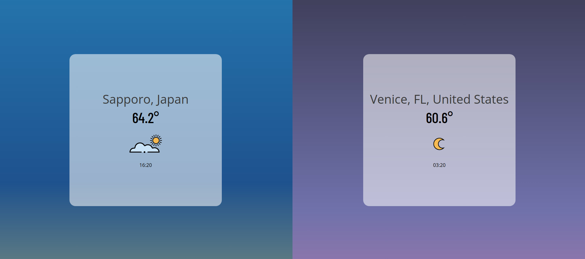

# Weather Compare

Weather compare is an application to see and compare the time and weather between two separate locations. The weather, time, and associated graphics are updated periodically throughout the course of the day even as the window remains open.

To function, this application needs an API key from https://www.visualcrossing.com/

After receiving a key, you can either place it in the code directly or, independently in a file titled 'api.Key.js' in the following format:

export const visualCrossingKey = 'API_KEY_HERE';